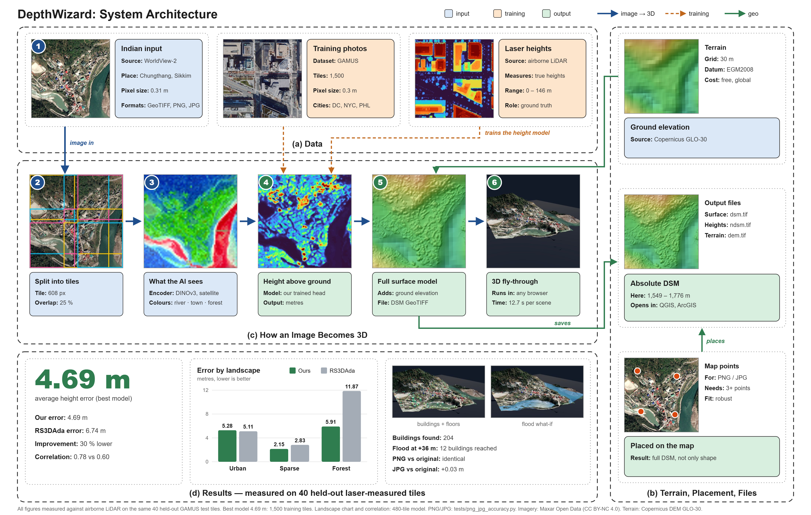

# DepthWizard: single-view height estimation and 3D flythrough

**Smart India Hackathon 2026 · Problem Statement 26175 · ISRO / Space Applications Centre**

> **Proprietary, all rights reserved.** No copying or reuse without written permission.
> See [LICENSE](LICENSE).

DepthWizard turns **one optical RGB image** (GeoTIFF, PNG, JPG or TIFF) into a
**metric elevation map** and opens it as a **navigable 3D scene** in the browser.

- **GeoTIFF in → absolute DSM out** (metres above sea level, same map grid as the image):
  `DSM = terrain (DEM) + height above ground (our model)`.
- **PNG / JPG in → relative DSM (rDSM)**, or heights in metres if the pixel size is
  known, or a full absolute DSM if 3+ map points (GCPs) are given.
- **3D viewer** (Three.js, runs offline): the photo draped on the terrain, orbit and
  first-person flight, height/slope/error colouring, contours, profiles, and
  **validation against a reference raster** (LiDAR, CartoDEM, survey).

---

## Results at a glance (all measured; sources linked)

| test | truth | our result | comparison |
|---|---|---|---|
| **GAMUS held-out test**, 40 tiles, height above ground ([RESULTS.md](RESULTS.md)) | airborne LiDAR | **RMSE 4.96 m · MAE 2.44 m · r 0.78** | RS3DAda (public weights, run by us on the same tiles) 6.74 m · r 0.60; predict-0 floor 9.35 m |
| same, by landscape | | urban 5.28 · sparse 2.15 · forest 5.91 m | RS3DAda 5.11 · 2.83 · 11.87 m |
| **USGS 3DEP LiDAR**, 8 US sites, whole pipeline, full DSM ([results/lidar_benchmark.md](results/lidar_benchmark.md)) | airborne LiDAR point cloud | hilly **3.84 m** · sparse **3.57 m** · forest 7.95 m · urban residential 5.40 m | DEM alone (no model): 5.88 · 4.99 · 8.43 · 6.95 m |
| PNG / JPG upload path, same 40 tiles ([results/png_jpg_accuracy.md](results/png_jpg_accuracy.md)) | airborne LiDAR | PNG identical to the original (4.96 m); JPG q90 4.99 m | |

Where it fails is reported too: tall downtown towers (35.95 m DSM RMSE) and dense
25 m forest canopy are under-predicted (see [Limitations](#limitations)).
Every number, with definitions: [`PPT Details/metrics/metrics_summary.md`](PPT%20Details/metrics/metrics_summary.md).

---

## Contents

1. [Problem and motivation](#problem-and-motivation) ·
2. [How it works](#how-it-works) ·
3. [Requirements coverage](#requirements-coverage) ·
4. [Data](#data) ·
5. [Model, training and evaluation](#model-training-and-evaluation) ·
6. [Metrics](#metrics) ·
7. [Install](#install) ·
8. [Run](#run) ·
9. [Reproduce the results](#reproduce-the-results) ·
10. [The viewer](#the-viewer) ·
11. [Tests](#tests) ·
12. [Project structure](#project-structure) ·
13. [Limitations](#limitations) ·
14. [Licence](#licence)

---

## Problem and motivation

DEMs and DSMs are needed for urban planning, flood and disaster work. Stereo,
LiDAR and InSAR are costly or sensor-dependent; a **single image** is the most
available input. The PS asks for an end-to-end pipeline that turns single-view
RGB remote-sensing images into elevation maps: an rDSM for non-georeferenced
images, an absolute metric DSM for georeferenced ones, and an interactive 3D
flythrough that can also validate heights against reference data.

**Key design decision: we predict height above ground (nDSM) in metres, not
depth.** Nadir imagery has no perspective, so monocular *depth* models (trained
on ground-level photos) give only relative depth, which the PS itself names as
the core problem. Our model is trained directly on airborne-LiDAR heights, so its
output is already in metres; a DEM then gives the absolute elevation.

## How it works



| step | what happens | code |
|---|---|---|
| 1. Read the image | GeoTIFF: CRS + pixel size from the file. PNG/JPG: pixel size from `--gsd`, or unknown (`--gsd-unknown`, relative shape), or placed on the map by 3+ GCPs (affine fit) | `dsm.py` `run()`, `georeference_image()` |
| 2. Normalise the pixel size | resample to the model's 0.5 m training GSD | `predict.py` `predict_height()` |
| 3. Tile | 608 px tiles, 25 % overlap, Gaussian-weighted blending | `predict.py` `tiled_predict()` |
| 4. Predict heights | frozen **DINOv3-SAT ViT-L/16** encoder (Meta, pre-trained on 493 M satellite images) + our trained **DPT-style head** → metres above ground. Test-time augmentation: identity + horizontal + vertical flip | `train_head.py` |
| 5. Add terrain | **Copernicus GLO-30** (30 m, EGM2008) fetched for the footprint and resampled onto the image grid; or any local DEM with `--dem` (e.g. **SRTM 30 m**, CartoDEM) | `dsm.py` `dem_on_grid()` |
| 6. Write outputs | `dsm.tif`, `ndsm.tif`, `dem.tif` (float32 GeoTIFF, same CRS/grid as the input), or `ndsm.tif` + `rdsm_0to1.png/.npy` for plain images; `report.json`, `SUMMARY.txt` | `dsm.py` |
| 7. Validate / calibrate (optional) | a reference raster is reprojected onto the run's grid and scored raw, after a datum offset, and after offset + scale (fitted on half the area, scored on the other half), next to a no-model baseline; writes `dsm_calibrated.tif` | `validate.py`, `calibrate.py` |
| 8. View | viewer assets (heights + texture + metadata) → Three.js | `dsm.py` `export_viewer()`, `web/index.html` |

**Scale calibration** (PS milestone 2) comes from three places: the model's
learned metric scale (trained on LiDAR metres), the pixel-size normalisation, and,
for absolute elevation, the DEM (or GCPs for plain images). When reference
heights exist, `validate.py` fits a robust offset + scale (`calibrate.fit_affine`:
RANSAC seed + Huber IRLS, scale clipped to 0.6–1.6) and reports on held-out
pixels whether it helps.

Backends: `dinov3` (ours; the live app picks the first `.pt` checkpoint it finds)
and `rs3dada` (SynRS3D public weights; the default of the `dsm.py` command line
because it needs no login).

## Requirements coverage

| PS requirement | where / status |
|---|---|
| PNG/JPG (and TIFF without coordinates) → rDSM | `dsm.py` (`rdsm_0to1.png`, `ndsm.tif`); live upload ✔ |
| GeoTIFF → absolute metric DSM, standard geospatial format | `dsm.tif` float32 GeoTIFF, input CRS and grid ✔ |
| Pre-trained backbone | DINOv3-SAT (frozen) ✔ (a satellite foundation model, not a relative-depth model: see the design decision) |
| Low-res DEM (e.g. SRTM) or GCPs for absolute scale | Copernicus GLO-30 by default, any DEM via `--dem`, GCPs for PNG/JPG ✔ |
| Project the image onto a 3D mesh in Three.js | ✔ texture-exact (identity UVs on the image grid) |
| First-person navigation, heights and slopes | Fly mode (W A S D), Orbit, height probe, slope colouring, profiles ✔ |
| Upload imagery, validate against reference data | live mode upload + "Check against a reference" ✔ |
| RMSE, MAE, correlation vs LiDAR across urban/sparse/hilly/forest | GAMUS (urban/sparse/forest) + 3DEP LiDAR (all four incl. hilly) ✔ |
| Standalone deployment | local app: `start_demo.bat` / `python serve.py --live`, fully offline after setup. ⚠ Not a packaged installer (needs Python) |

Full audit with evidence: [`PPT Details/audit/requirements_audit.md`](PPT%20Details/audit/requirements_audit.md).

## Data

**GAMUS** (`earthflow/GAMUS` on Hugging Face, CC BY 4.0; Xiong et al., arXiv
2305.14914), the dataset recommended by the PS reference repo. Facts read from the
files, not assumed:

- HDF5, one dataset per file (`"image"`), layout `{images,heights,classes}/{train,val,test}/`.
- RGB 1024 × 1024 uint8; heights (AGL) float32 metres = **airborne-LiDAR height
  above ground**; 7 land-cover classes (3 building, 6 tree, 4 water).
- The RGB suffix is `_RGB` for DC/PHL but `_IMG` for NYC; pairing on `_RGB` alone
  silently drops every NYC tile, so pairing is by stem across folders.
- No geotransform or nodata attribute. DC tiles use an exact −5.0 sentinel
  (treated as nodata); NYC's small negatives are real LiDAR noise.
- GSD 0.30 m is **asserted** (DFC2019/US3D spec, checked by car length), not read.

**Preprocessing for training** (`colab_train.py`, `train_head.py`): resample
1024 px at 0.3 m to 608 px at 0.5 m; encode once with the frozen DINOv3 and cache
features in fp16; heights clipped to [0, 150] m for the loss (PHL has 146 m towers);
augmentation = flips + 90° rotations (colour augmentation is impossible on cached
features).

**Splits used**: 480 train tiles, 48 validation tiles (model selection), 40
held-out test tiles, identical for every method in RESULTS.md.

**Independent LiDAR benchmark** (`tests/lidar_benchmark.py`): USDA **NAIP** 0.6 m
aerial GeoTIFFs and **USGS 3DEP** airborne LiDAR point clouds (both US public
domain, via Microsoft Planetary Computer, no account). Truth is rebuilt from the
points on a 2 m grid: surface = highest non-noise return, ground = class-2 returns,
height = surface − ground, 3 × 3 median against isolated spikes. The ready-made
3DEP 2 m rasters were checked and rejected (their DSM put forest canopy at 8.9 m
vs 24.4 m from the points).

**Samples in `samples/`**: Chungthang, Sikkim (Maxar WorldView-2, CC BY-NC 4.0)
with its Copernicus DEM; Park City, Utah (NAIP 2021) with its 3DEP LiDAR surface
for a live validation demo.

## Model, training and evaluation

- Encoder `facebook/dinov3-vitl16-pretrain-sat493m`, frozen; features from blocks
  6/12/18/24; normalisation mean (0.430, 0.411, 0.296), std (0.213, 0.156, 0.143),
  checked against the official processor at runtime.
- Head: DPT-style, 30 epochs, batch 4, AdamW lr 1e-4, weight decay 1e-4, cosine
  schedule with warm-up, masked Huber loss on metres.
- **Selection on validation only**: best val RMSE 3.765 m at epoch 22 → `best.pt`.
- Evaluation (`eval.py`): per pixel over valid LiDAR pixels, predictions clamped at
  ≥ 0; landscape from each tile's class map (urban ≥ 20 % buildings, forest ≥ 35 %
  trees, else sparse). The harness's own noise floor is 0.13 m (ground truth fed in
  as the prediction), explained by the clamp on 6.5 % negative LiDAR pixels.
- Baselines on the same tiles: predict 0 everywhere, and RS3DAda (SynRS3D public
  weights; GAMUS is not in their paper, so there is no published number to quote).
- A 1,500-train-tile run was reported at 4.69 m, but its results file is not in this
  repo, so it is not used anywhere as a verified number.

## Metrics

Per pixel, e = prediction − reference (metres): **RMSE** = √mean(e²), **MAE** =
mean |e|, **ME / bias** = mean(e) (negative = too low), **r** = Pearson correlation,
**within x m** = share of |e| < x. These are the PS's RMSE, MAE and correlation.
For a full DSM, r is ~0.99 on any hilly site because terrain dominates, so we always
also report the **DEM-alone** baseline and the height-above-ground error.

## Install

Python 3.10+ (tested with 3.13 on Windows 11, RTX 3060 laptop GPU).

```bash
# 1. PyTorch for your GPU (or CPU) from https://pytorch.org/get-started/locally/
pip install -r requirements.txt
# 2. optional: only for tests/lidar_benchmark.py and docs/lidar_sensing_figure.py
pip install pystac-client planetary-computer "laspy[lazrs]" pyproj
```

**DINOv3 weights are gated** (DINOv3 License, Meta). Accept the licence on Hugging
Face once, then log in with `hf auth login` (never paste the token into code). After
the first download, `serve.py --live` detects the cached weights and runs **offline
without a token**. Our trained head (`best.pt`, from the Colab run) goes in
`models/` or `dw_run/ckpt/`, or pass `--models-dir`.

## Run

**Demo app (Windows):** double-click `start_demo.bat`, or:

```bash
python serve.py --live          # http://localhost:8777/?assets=assets_live
```

**Command line, image → DSM:**

```bash
python dsm.py samples/chungthang_wv2.tif --out out_dsm/chungthang --backend dinov3 --head models/best.pt
python dsm.py photo.jpg --gsd 0.5 --out out_dsm/photo                # PNG/JPG, known pixel size
python dsm.py photo.jpg --gsd-unknown --out out_dsm/photo            # relative shape only
python dsm.py photo.jpg --gcp 120,80,27.60,88.64 --gcp ... --gcp ... # 3+ map points -> full DSM
python dsm.py image.tif --dem srtm.tif                               # your own DEM instead of GLO-30
```

**Score a run against a reference:**

```bash
python validate.py out_dsm/chungthang reference_dsm.tif
```

**Demo files**: [`demo/`](demo/README.md) holds every input used in the demo video, one
folder per part: a GeoTIFF with its LiDAR reference, the same image as PNG / JPG /
plain TIFF, GAMUS PNGs with their LiDAR height TIFFs, the Indian GeoTIFF, and the
result charts (rebuild: `python docs/make_demo_folder.py --gamus <GAMUS test folder>`).

**LiDAR truth vs real image demo** (not part of the normal app; only with this flag):

```bash
python serve.py --demo-lidar
```

| command | important options |
|---|---|
| `dsm.py` | `--backend {dinov3,rs3dada}`, `--head best.pt`, `--model ours` (expects `dw_run/ckpt/best_1500.pt`), `--gsd`, `--gsd-unknown`, `--gcp X,Y,LAT,LON`, `--dem`, `--window col,row,w,h`, `--no-tta`, `--export web/assets_live`, `--no-buildings` |
| `serve.py` | `--live` (upload + run + validate), `--demo-lidar`, `--models-dir DIR`, `--port` (8777) |
| `validate.py` | `run_dir reference.tif` |
| `export_viewer.py` | `--lidar-demo --root <GAMUS test> --pred-dir <predictions>` builds `web/assets_lidar` |

## Reproduce the results

| result | command |
|---|---|
| training + GAMUS test (RESULTS.md) | Colab: [`COLAB.md`](COLAB.md) → `colab_train.py` (resumable) |
| GAMUS test through the upload path (reproduces 4.96 m locally) | `python tests/png_jpg_accuracy.py --tiles <gamus test folder> --head models/best.pt` |
| USGS 3DEP LiDAR benchmark | `HF_HUB_OFFLINE=1 python tests/lidar_benchmark.py --head models/best.pt` (≈ 5 min, internet) |
| metrics tables and chart | `python docs/ppt_materials.py` |
| LiDAR sensing figure | `python docs/lidar_sensing_figure.py --work %TEMP%/lb` (after the benchmark) |
| RS3DAda baseline | `kaggle_run.py` (Kaggle T4) |

## The viewer

- **Pipeline bar**: Image › Model › Terrain › DSM › Validated › Export, lit from the
  scene's real state.
- **Surface**: Photo, Height, Slope, Error (needs a reference); **contour lines** on
  any surface; vertical exaggeration; sun direction and elevation (tested:
  `tests/test_sun_geo.mjs`).
- **Navigate**: Orbit (drag, scroll, click to read a height) or Fly (W A S D, Q/E);
  **Measure distance** draws a height profile (closes when Measure is turned off).
- **Scene info**: image, model, output type, map projection, pixel size, extent,
  elevation range, terrain source, vertical datum, validation status.
- **Live mode**: upload, choose a model, run, then "Check against a reference"
  (accuracy table + error map), then **Compare side by side**: photo, reference,
  our heights and error on the same pixels, with a swipe divider and hover read-out.
- **Export**: DSM / heights / terrain / error / calibrated GeoTIFFs, run report,
  textured **3D model (.glb, true scale)**, screenshot.
- **Tools**: flood "bathtub" screening, candidate buildings with floor estimates,
  recorded fly-through tour.
- **LiDAR demo** (`--demo-lidar`): real image, LiDAR truth, our model and error on one
  pixel grid, with a swipe divider and hover read-out. The three GAMUS tiles are the
  median-error tile of each landscape, not picked.

## Tests

| test | covers | run |
|---|---|---|
| `tests/test_dsm_cpu.py` | DSM pipeline, GeoTIFF/PNG paths, GCPs, DEM, CLI | `python tests/test_dsm_cpu.py` |
| `tests/test_live_cpu.py` | live server: models, upload, jobs, errors | `python tests/test_live_cpu.py` |
| `tests/test_validate_cpu.py` | reference scoring: offset, scale, held-out split, gaps | `python tests/test_validate_cpu.py` |
| `tests/test_train_head_cpu.py` | head, loss, caching (needs `gamus/test` tiles) | `python tests/test_train_head_cpu.py` |
| `tests/test_sun_geo.mjs` | sun direction, shadows, compass (Node) | `node --test tests/test_sun_geo.mjs` |

Latest results are recorded in [`PPT Details/audit/requirements_audit.md`](PPT%20Details/audit/requirements_audit.md).

## Project structure

```
dsm.py              image -> DSM GeoTIFF (+ viewer assets); the main pipeline
predict.py          GSD normalisation, tiling, TTA, backends
train_head.py       DINOv3 encoder wrapper, DPT head, loss, training loop
colab_train.py      cache -> train -> evaluate on Colab (resumable)
data.py             GAMUS loader, pairing, nodata handling, landscape buckets
eval.py             metrics harness (RMSE, MAE, bias, r, thresholds, buckets)
calibrate.py        ground shift and robust affine calibration
validate.py         score / calibrate a run against a reference raster
live.py, serve.py   local web server, live mode, downloads, --demo-lidar
export_viewer.py    GAMUS tiles -> viewer assets, LiDAR demo builder
web/                viewer (index.html, lib/geo.js, vendor/three), scene assets
tests/              unit/integration tests + benchmark scripts
results/            measured benchmark outputs
docs/               architecture diagram and figure scripts
samples/            Chungthang (India) and Park City (US, with LiDAR) inputs
demo/               every file used in the demo video (inputs + references + charts)
PPT Details/        presentation material: metrics, charts, LiDAR figures, audit
```

## Limitations

- **Trained on US aerial imagery (GAMUS)**; ISRO satellite imagery is a different
  sensor and region, so accuracy there is not yet measured (no Indian LiDAR truth).
- **Tall towers and dense canopy are under-predicted**: Pittsburgh downtown 35.95 m
  DSM RMSE; a 25 m forest predicted at about 3 m (3DEP benchmark). On GAMUS, urban
  RMSE (5.28 m) is slightly worse than RS3DAda (5.11 m).
- **Copernicus GLO-30 is a radar surface model**: it already contains part of the
  canopy and buildings, so DEM + model double-counts a little (written into every
  output; calibration shrinks the model scale to compensate).
- Ordinary orthophotos make tall buildings lean, so their roofs are offset from
  the LiDAR footprint.
- 3DEP benchmark: 8 sites, photo and LiDAR up to 2 years apart (years in the report).
- Not a packaged installer: needs Python and the dependencies; offline after setup.

## Licence

**All rights reserved.** You may not copy, modify, redistribute or reuse any part of
this project without written permission. SIH 2026 organisers and ISRO/SAC evaluators
may run it solely to evaluate this submission. See [LICENSE](LICENSE).

Third-party material keeps its own licence (details in LICENSE): GAMUS (CC BY 4.0),
Maxar Open Data (CC BY-NC 4.0), Copernicus DEM GLO-30, USDA NAIP and USGS 3DEP (US
public domain), Three.js (MIT, bundled in `web/vendor/three/`). Downloaded at run
time, not included: DINOv3 weights (DINOv3 License, Meta), SynRS3D / RS3DAda (MIT).
